<div align="center">

# Instituto Tecnológico Nacional de México

### Instituto Tecnológico de Oaxaca

**Carrera:** Ingeniería en Sistemas Computacionales <br><br>
**Materia:** Programación Web<br><br>
**Actividad:** Act3. CRUD en Spring Boot y Relaciones<br><br>
**Docente:** Adelina Martínez Nieto<br><br>
**Integrante:** Enríquez Rodríguez Alejandro Guillermo<br><br>
**Fecha de entrega:** 19 de julio del 2026<br><br>

</div>

# Act3 T4 — CRUD con Spring Boot, JPA y MySQL

## Descripción del proyecto

CRUD completo construido con **Spring Boot + Spring Data JPA**, conectado a una base de datos real en **MySQL**, con dos entidades relacionadas entre sí. El CRUD se probó completamente mediante peticiones REST con Postman, dentro del mismo proyecto Spring Boot, sin frontend separado.

## Entidades y relación

Elegí **Camioneta** y **Marca** como entidades relacionadas:

- Una **Marca** puede tener muchas **Camionetas** → `@OneToMany` (en `Marca`)
- Una **Camioneta** pertenece a una sola **Marca** → `@ManyToOne` (en `Camioneta`), con la llave foránea `marca_id`

## Configuración de la base de datos

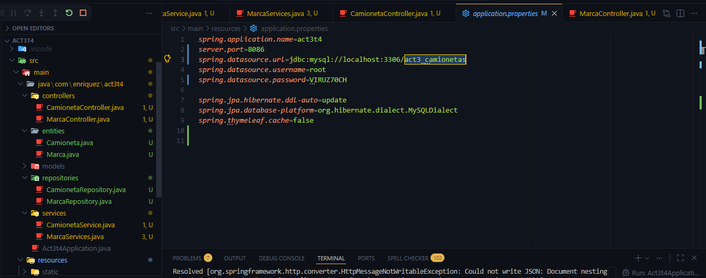

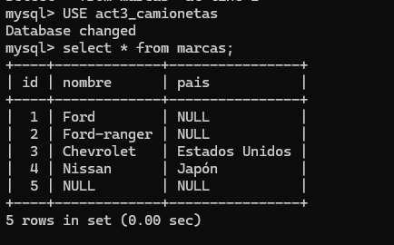

## Separación en capas (Entity, Repository, Service, Controller)

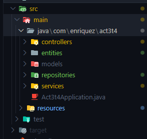

## CRUD probado con Postman

### Crear (POST)

**Marcas:**
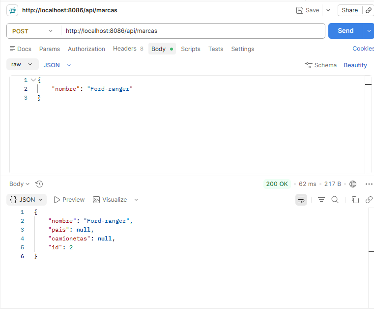

**Camionetas:**
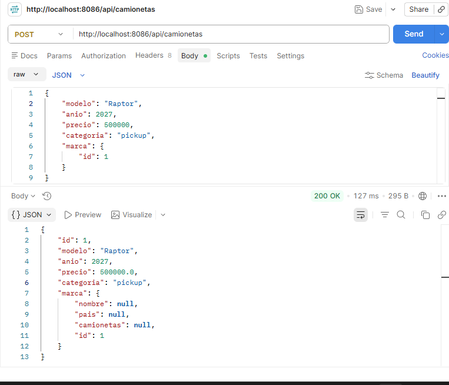

### Leer (GET)

**Listado de marcas:**
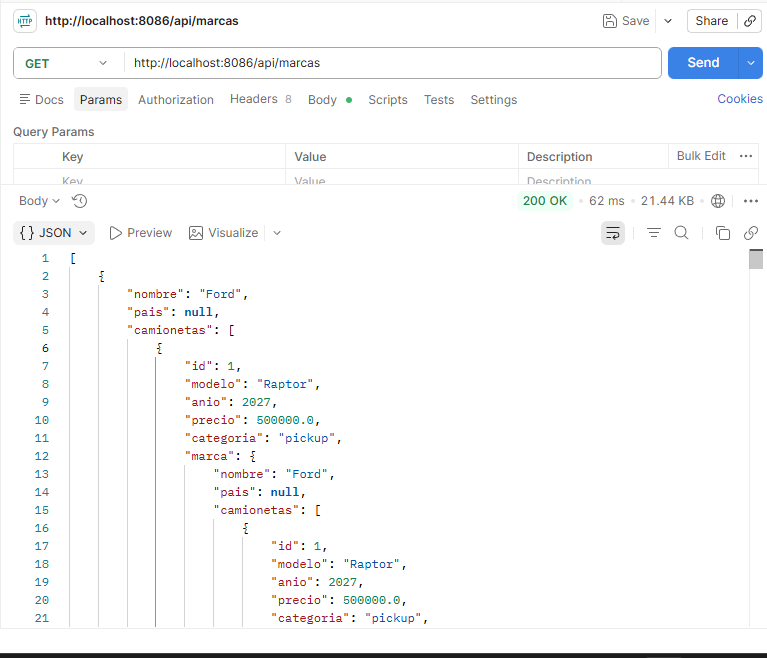

**Listado de camionetas, con la relación reflejada (se ve el objeto marca completo, no solo su id):**
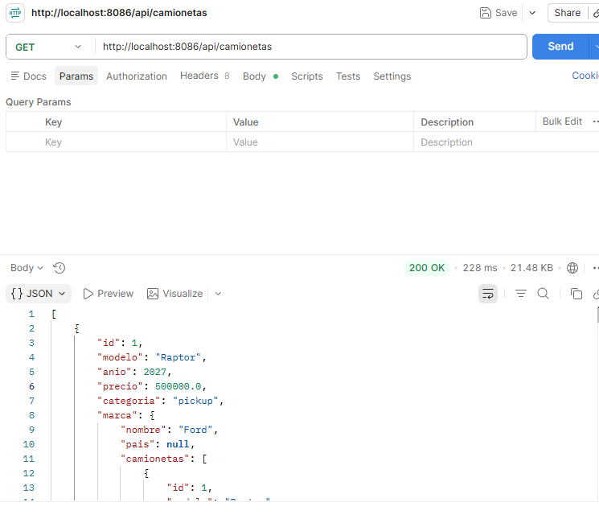

### Actualizar (PUT)

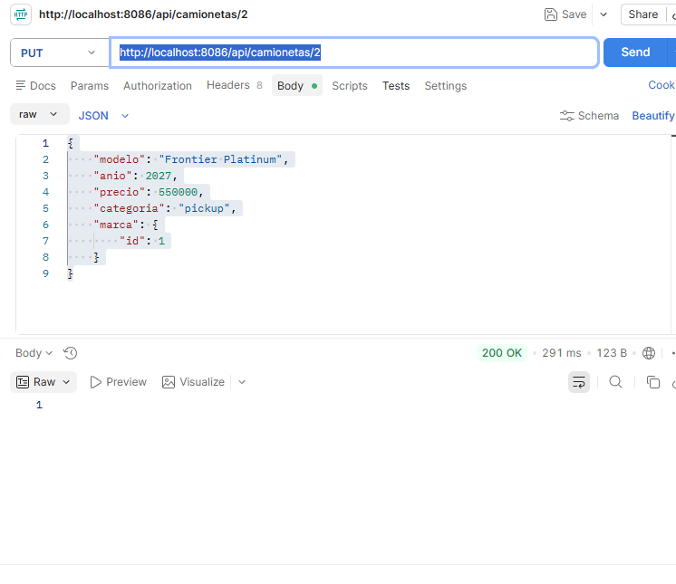

### Eliminar (DELETE)

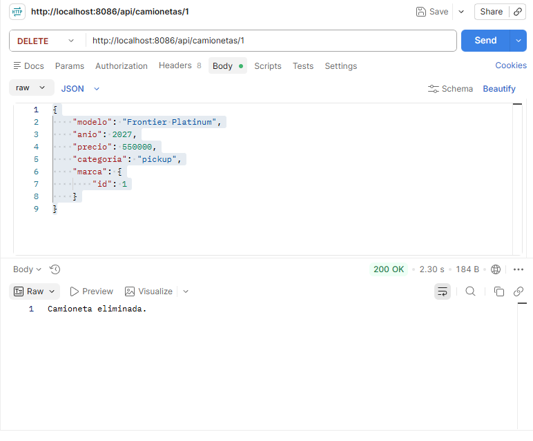

### Evidencia adicional

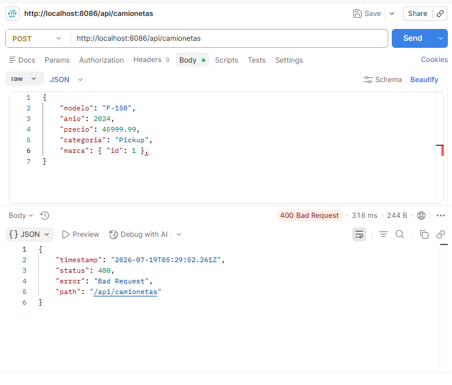

## Documentación técnica

### La relación reflejada correctamente
Al consultar una camioneta, la respuesta incluye el objeto `marca` completo (nombre, país), no solo su id numérico. Esto se logró agregando `@JsonIgnoreProperties({"camionetas"})` sobre el campo `marca` en la entidad `Camioneta`, evitando además la recursión infinita que se produce porque `Marca` también tiene una lista de `Camionetas`.

### Repository
Cada entidad tiene su propia interfaz que extiende `JpaRepository<Entidad, TipoId>`. Con solo eso, Spring Data JPA genera automáticamente los métodos de guardar, buscar por id, listar todo y eliminar, sin necesidad de escribir SQL manualmente.

### Service
La lógica de negocio vive en las clases `CamionetaService` y `MarcaService`, separada del controlador. El controlador solo recibe la petición HTTP y delega el trabajo al Service correspondiente.

### Controller
`CamionetaController` expone los 4 endpoints del CRUD (`GET`, `POST`, `PUT`, `DELETE`) bajo la ruta `/api/camionetas`. `MarcaController` expone los endpoints necesarios para crear y listar marcas, ya que son necesarias antes de poder crear camionetas.

## Endpoints

| Método | Ruta | Descripción |
|---|---|---|
| GET | `/api/camionetas` | Lista todas las camionetas |
| GET | `/api/camionetas/{id}` | Obtiene una camioneta por id, con su marca |
| POST | `/api/camionetas` | Crea una nueva camioneta |
| PUT | `/api/camionetas/{id}` | Actualiza una camioneta existente |
| DELETE | `/api/camionetas/{id}` | Elimina una camioneta |
| GET | `/api/marcas` | Lista todas las marcas |
| POST | `/api/marcas` | Crea una nueva marca |

---

## Estructura del proyecto

```
ERAGact3_t4/
├── pom.xml
├── screenshots/
├── postman/
│   └── coleccion_act3.json
└── src/
    └── main/
        ├── java/com/enriquez/act3t4/
        │   ├── Act3t4Application.java
        │   ├── entities/
        │   │   ├── Camioneta.java
        │   │   └── Marca.java
        │   ├── repositories/
        │   │   ├── CamionetaRepository.java
        │   │   └── MarcaRepository.java
        │   ├── services/
        │   │   ├── CamionetaService.java
        │   │   └── MarcaService.java
        │   └── controllers/
        │       ├── CamionetaController.java
        │       └── MarcaController.java
        └── resources/
            └── application.properties
```

---

## Tecnologías utilizadas

- **Java 21**
- **Spring Boot** (Spring Web + Spring Data JPA)
- **MySQL**
- **Maven**
- **Postman** — pruebas del CRUD completo
- **Git / GitHub**

---

## Puertos usados en el VPS

- Actividad 1: puerto **8082** (sigue corriendo sin cambios)
- Actividad 2: puerto **8084** (sigue corriendo sin cambios)
- Actividad 3: puerto **8086**

---

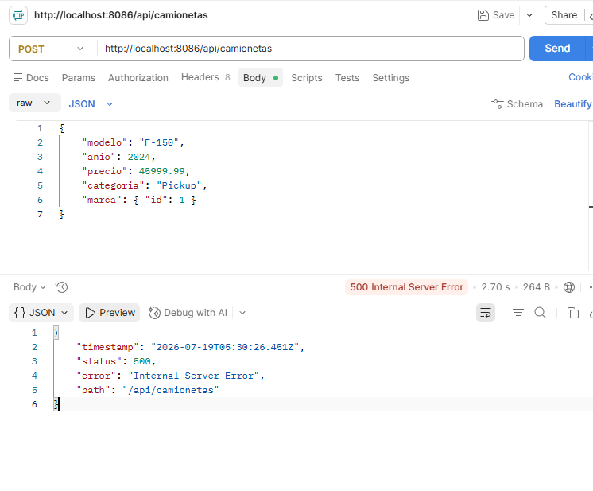
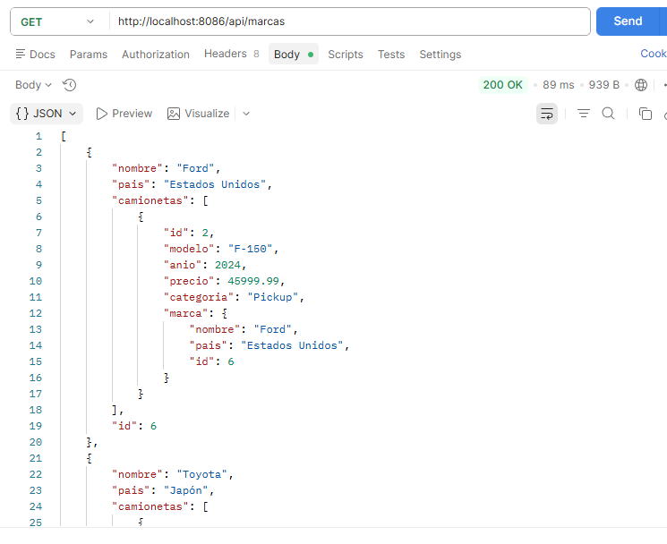
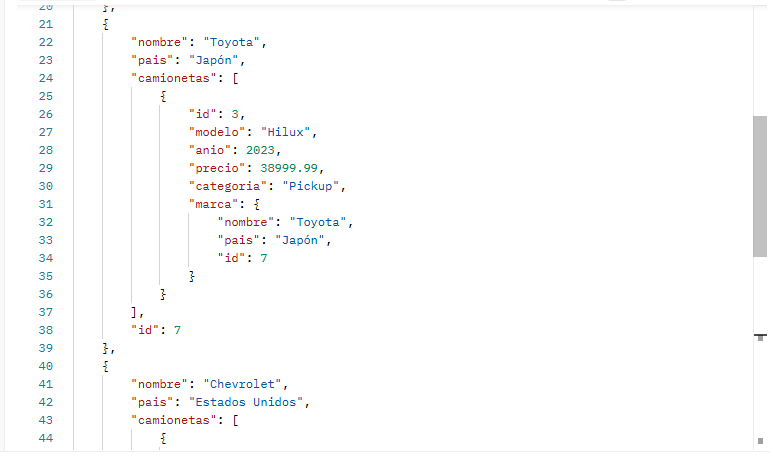
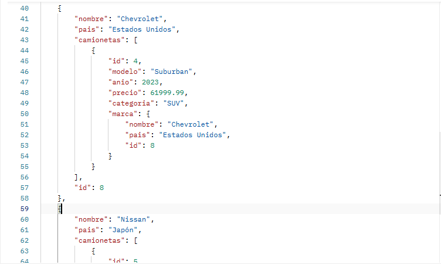
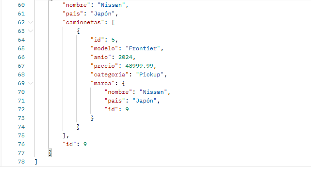

## Ver en vivo

🔗 **Repositorio:** https://github.com/AlejandroGuillermo7/ERAGact3_t4

🔗 **Proyecto en el VPS:**
- http://67.207.87.232:8086/api/camionetas
- http://67.207.87.232:8086/api/marcas
- Todas mi actividades funcionando
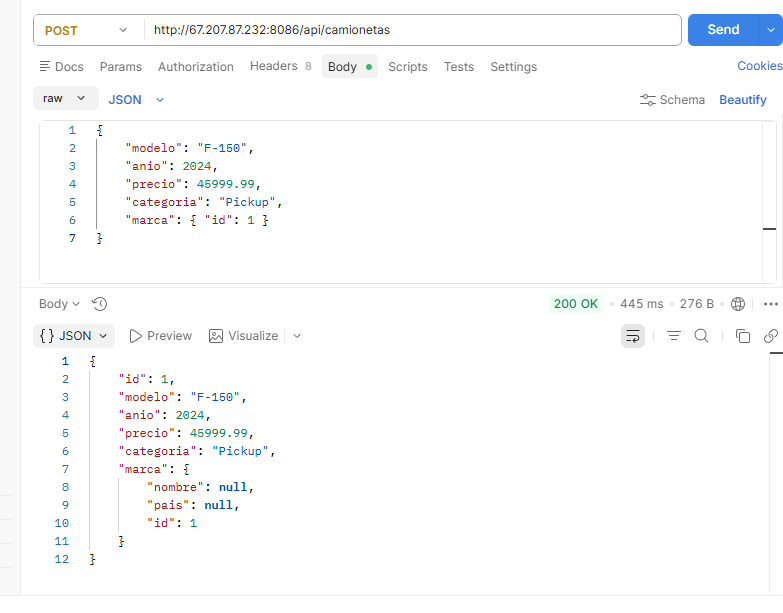
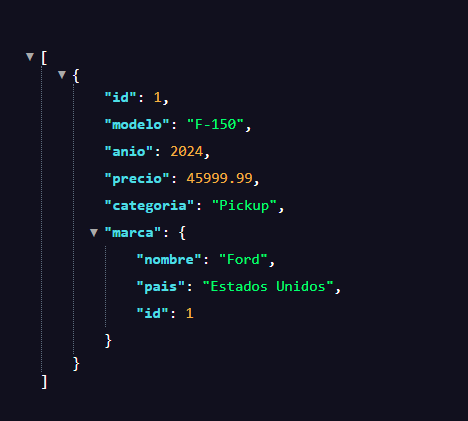

🔗 **Colección de Postman:** `postman/coleccion_act3.json` (incluida en este repositorio)

---

## Autor

**Alejandro Guillermo Enríquez Rodríguez**
Estudiante de Ingeniería en Sistemas Computacionales — Instituto Tecnológico de Oaxaca